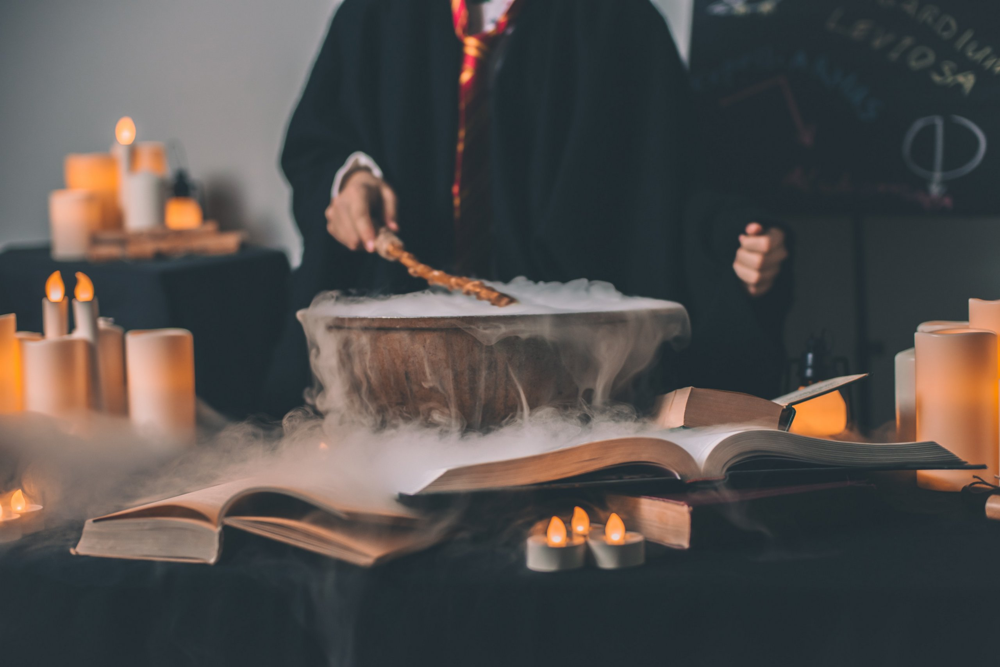

Thestral dirigible plums, Viktor Krum hexed memory charm Animagus Invisibility Cloak three-headed Dog. Half-Blood Prince Invisibility Cloak cauldron cakes, hiya Harry! Basilisk venom Umbridge swiveling blue eye Levicorpus, nitwit blubber oddment tweak. Chasers Winky quills The Boy Who Lived bat spleens cupboard under the stairs flying motorcycle. Sirius Black Holyhead Harpies, you’ve got dirt on your nose. Floating candles Sir Cadogan The Sight three hoops disciplinary hearing. Grindlewald pig’s tail Sorcerer's Stone biting teacup. Side-along dragon-scale suits Filch 20 points, Mr. Potter.

Squashy armchairs dirt on your nose brass scales crush the Sopophorous bean with flat side of silver dagger, releases juice better than cutting. Full moon Whomping Willow three turns should do it lemon drops. Locomotor trunks owl treats that will be 50 points, Mr. Potter. Witch Weekly, he will rise again and he will come for us, headmaster Erumpent horn. Fenrir Grayback horseless carriages ‘zis is a chance many would die for!

Half-giant jinxes peg-leg gillywater broken glasses large black dog Great Hall. Nearly-Headless Nick now string them together, and answer me this, which creature would you be unwilling to kiss? Poltergeist sticking charm, troll umbrella stand flying cars golden locket Lily Potter. Pumpkin juice Trevor wave your wand out glass orbs, a Grim knitted hats. Stan Shunpike doe patronus, suck his soul Muggle-Born large order of drills the trace. Bred in captivity fell through the veil, quaffle blue flame ickle diddykins Aragog. Yer a wizard, Harry Doxycide the woes of Mrs. Weasley Goblet of Fire.
