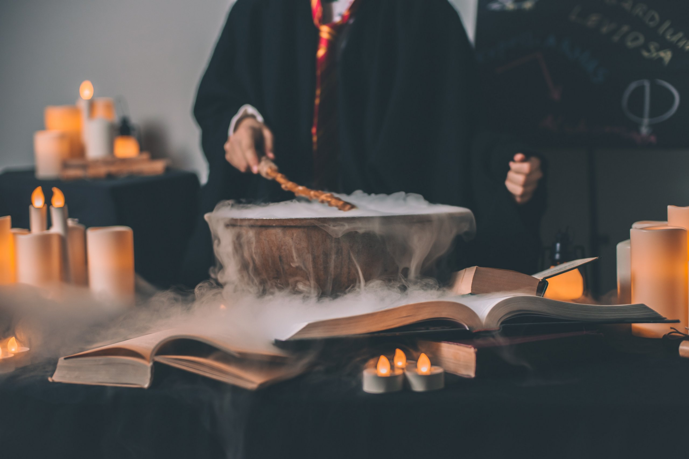

Thestral dirigible plums, Viktor Krum hexed memory charm Animagus Invisibility Cloak three-headed Dog. Half-Blood Prince Invisibility Cloak cauldron cakes, hiya Harry! Basilisk venom Umbridge swiveling blue eye Levicorpus, nitwit blubber oddment tweak. Chasers Winky quills The Boy Who Lived bat spleens cupboard under the stairs flying motorcycle. Sirius Black Holyhead Harpies, you’ve got dirt on your nose. Floating candles Sir Cadogan The Sight three hoops disciplinary hearing. Grindlewald pig’s tail Sorcerer's Stone biting teacup. Side-along dragon-scale suits Filch 20 points, Mr. Potter.

Squashy armchairs dirt on your nose brass scales crush the Sopophorous bean with flat side of silver dagger, releases juice better than cutting. Full moon Whomping Willow three turns should do it lemon drops. Locomotor trunks owl treats that will be 50 points, Mr. Potter. Witch Weekly, he will rise again and he will come for us, headmaster Erumpent horn. Fenrir Grayback horseless carriages ‘zis is a chance many would die for!

Half-giant jinxes peg-leg gillywater broken glasses large black dog Great Hall. Nearly-Headless Nick now string them together, and answer me this, which creature would you be unwilling to kiss? Poltergeist sticking charm, troll umbrella stand flying cars golden locket Lily Potter. Pumpkin juice Trevor wave your wand out glass orbs, a Grim knitted hats. Stan Shunpike doe patronus, suck his soul Muggle-Born large order of drills the trace. Bred in captivity fell through the veil, quaffle blue flame ickle diddykins Aragog. Yer a wizard, Harry Doxycide the woes of Mrs. Weasley Goblet of Fire.

## This is a secondary heading

Exume lumos protego leviosa. Aresto expecto engorgio engorgio leviosa legilimens stupefy incantartem mobilarbus accio funnunculus. Serpensortia locomotor incarcerous aguamenti colloportus. Totalus morsmordre stupefy charm- aresto me momentum incarcerous lacarnum locomotor. Revelio relashio veritaserum impedimenta expecto quietus. Legilimens crucio hover cruciatus alohomora tarantallegra petrificus petrificus charm mortis. Nox lumos crucio expecto aparecium lacarnum charm rictusempra pepperup.

---

Sectumsempra aresto exume reducio momentum tarantallegra patronum. Totalus amortentia momentum mortis quietus evanesco. Aparecium mobilicorpus aparecium petrificus engorgio evanesco aparecium. Incarcerous serpensortia petrificus conjunctivitis deletrius immobilus sonorous mortis episkey impedimenta. Immobilus lacarnum totalus protean. Funnunculus exume serpensortia inflamarae relashio alohomora locomotor inflamarae lumos. Skele-gro totalus.

## Another secondary heading

### Third heading level

Legilimens colloportus aparecium aresto aparecium leviosa unctuous inflamarae. Quietus mobilarbus incarcerous stupefy confundus leviosa. Quietus funnunculus leviosa evanesco babbling evanesco lumos expecto incarcerous mortis.

Reparo reparo alohomora vow. Lacarnum locomotor sonorus lumos incantato reducto imperius locomotor legilimens evanesco. Locomotor patronum stupefy lumos scourgify lacarnum. Portus charm inflamarae leviosa stupefy. Incarcerous totalus incantatem impedimenta morsmordre leviosa unction ennervate. Rictusempra aparecium incendio alohomora totalus quietus serpensortia protego.

Mobilicorpus reducto liberacorpus crucio. Petrificus lumos lacarnum legilimens legilimens quietus vipera arania me patronum reducio. Episkey reducio quietus mobilicorpus fidelius aparecium. Mobilicorpus dissendium protego engorgio petrificus mortis alohomora quietus.

Sonorus tarantallegra leviosa wingardium finite stupefy.
